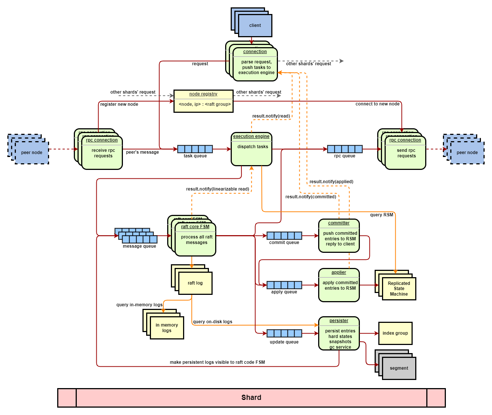

# rafter

[](https://dl.circleci.com/status-badge/redirect/gh/JasonYuchen/seastar_playground/tree/circleci-project-setup)
[](https://github.com/JasonYuchen/seastar_playground/blob/master/LICENSE)

## Introduction

rafter (*in progress*) is a pipelined asynchronous multi-raft group library with an in-memory key-value replicated state
machine based on seastar.

rafter is deeply inspired by

- [dragonboat](https://github.com/lni/dragonboat)
- [etcd](https://github.com/etcd-io/etcd)
- [braft](https://github.com/baidu/braft)
- [scylla](https://github.com/scylladb/scylla)
- [seastar](https://github.com/scylladb/seastar), insights
  available [here](https://github.com/JasonYuchen/notes/tree/master/seastar)



## Build & Setup

- prerequisite
  - Compiler with C++20 support, tested with clang-15
  - Seastar, taken care of by submodule (the installation of Seastar is not trivial, please refer to
    this [post](https://github.com/JasonYuchen/notes/blob/master/seastar/Setup.md))
  - GoogleTest, taken care of by rafter's cmake configuration
  - Simdjson, taken care of by rafter's cmake configuration

  ```shell
  # ubuntu 22.04
  git submodule update --init --recursive
  sudo ./install-dependencies.sh clang++-15
  mkdir build
  cmake -DCMAKE_BUILD_TYPE=Debug -DCMAKE_CXX_COMPILER=clang++-15 -B build -S .
  ninja -C build -j $(nproc)
  
  # run tests
  ./build/test/rafter_test
  ```

*it is recommended to use [ninja](https://github.com/ninja-build/ninja), [mold](https://github.com/rui314/mold) (
and [ccache](https://github.com/ccache/ccache) if you want to play with the source code) to accelerate build.*

- single node quorum demo

  ```shell
  > ./build/rafter_main --smp 2 --memory 1G --trace true --config_file rafter-template.yaml &&
  
  # initiating a new cluster with single node quorum
  > curl --location --request POST 'http://127.0.0.1:30615/clusters' \
  --header 'Content-Type: application/json' \
  --data-raw '{
      "clusterId": 1,
      "nodeId": 1,
      "electionRTT": 50,
      "heartbeatRTT": 5,
      "snapshotInterval": 0,
      "compactionOverhead": 0,
      "peers": [
          {"nodeId" : 1, "address": "127.0.0.1:30615"}
      ]
  }'
  
  cluster_id: 1, node_id: 1, election_rtt: 50, heartbeat_rtt: 5, snapshot_interval: 0, compaction_overhead: 0, max_in_memory_log_bytes: 18446744073709551615, check_quorum: 0, observer: 0, witness: 0, quiesce: 0
  
  # propose a key-value pair to default kv statemachine
  > curl --location --request PUT 'http://127.0.0.1:30615/cluster/1?key=hello&value=world'
  
  completed:OK
  
  # query a key
  > curl --location --request GET 'http://127.0.0.1:30615/cluster/1?key=hello'
  
  completed:world
  
  # query a non-existent key
  > curl --location --request GET 'http://127.0.0.1:30615/cluster/1?key=not_set'
  
  completed:NOT FOUND
  ```

  ```log
  ...
  # intiating (the cluster_id = 1 is hosted in shard 1 since we have 2 shards)
  INFO  2022-09-25 11:36:35,103 [shard 1] core - raft[gid[00001,00001],r:follower,fi:1,li:0,t:1]: become follower
  INFO  2022-09-25 11:36:35,113 [shard 1] rsm - gid[00001,00001] applied: type:add_node, ccid:0, index:1, node_id:1, address:127.0.0.1:30615
  INFO  2022-09-25 11:36:39,219 [shard 1] core - raft[gid[00001,00001],r:pre_candidate,fi:1,li:1,t:1]: become pre_candidate
  WARN  2022-09-25 11:36:39,220 [shard 1] core - raft[gid[00001,00001],r:pre_candidate,fi:1,li:1,t:1]: received request_prevote from 1
  INFO  2022-09-25 11:36:39,220 [shard 1] core - raft[gid[00001,00001],r:candidate,fi:1,li:1,t:2]: become candidate
  WARN  2022-09-25 11:36:39,220 [shard 1] core - raft[gid[00001,00001],r:candidate,fi:1,li:1,t:2]: received request_vote from 1
  INFO  2022-09-25 11:36:39,220 [shard 1] core - raft[gid[00001,00001],r:leader,fi:1,li:1,t:2]: become leader with 0 pending config change
  ...
  # propose (use noop session for simplicity)
  TRACE 2022-09-25 11:37:01,476 [shard 1] rafter - nodehost::get_noop_session: cluster_id:1
  TRACE 2022-09-25 11:37:01,476 [shard 1] rafter - nodehost::propose: cluster_id:1 cmd:hello=world
  TRACE 2022-09-25 11:37:01,506 [shard 1] core - peer::propose_entries: size:1
  TRACE 2022-09-25 11:37:01,507 [shard 1] rafter - gid[00001,00001] kv_statemachine::update: index:3, cmd:hello=world
  ...
  # query
  TRACE 2022-09-25 11:37:11,907 [shard 1] rafter - nodehost::linearizable_read: cluster_id:1 query:hello
  TRACE 2022-09-25 11:37:11,907 [shard 1] rafter - nodehost::read_index: cluster_id:1
  TRACE 2022-09-25 11:37:11,924 [shard 1] core - peer::read_index: [2714918299034996758,0]
  TRACE 2022-09-25 11:37:11,975 [shard 1] rafter - gid[00001,00001] kv_statemachine::lookup: cmd:hello
  ...
  ```

## Roadmap

1. finalize all modules with extensive tests
2. provide detail docs and notes
3. prepare a docker image for build and demo
4. chaos tests (maybe jepsen tests)
5. benchmark and performance optimization

## Module

### Node Host

The nodehost manages and schedules all raft groups, storage, transport and replicated state machines.

TBD

### Raft Core State Machine

The [core](core/README.md) module implements the raft algorithm based on the etcd's design.

1. ⭕design doc
2. ✔️election with prevote
3. ✔️leader lease
4. ✔️leadership transfer
5. ⚠️log compaction
6. ⚠️snapshot
7. ✔️single membership change
8. ⭕joint consensus
9. ✔️observer
10. ✔️witness
11. ✔️quiesce
12. ✔️linearizable semantics

### Storage

The [storage](storage/README.md) module works as the WAL of the raft groups, managing the persistent log entries as well
as the snapshots and the configurations of the clusters.

1. ✔️design doc (lack in-memory log explanation)
2. ✔️segment, a WAL unit
3. ✔️index, for indexing raft logs (lack dump&load)
4. ✔️segment_manager, implementation of logdb interface for managing raft persistent logs

### Transport

The [transport](transport/README.md) module based on the seastar's rpc framework works as a messaging service for
clusters.

1. ⚠️design doc
2. ✔️exchanger, for exchanging raft messages
3. ✔️registry, for group discovery and peer addresses management
4. ⚠️express, for sending/receiving replicated state machine's snapshot

### Replicated State Machine

The [rsm](rsm/README.md) module bridges the user-defined replicated state machine (e.g. an in-memory key-value
store) and the Raft Core State Machine (also Storage, Transport), managing the lookup, update operations as well as
snapshot taking, recovering actions of the user's state machine.

A naive in-memory key-value storage is provided to demonstrate the interactions between a user
defined replicated state machine and the underlying framework.

1. ⭕design doc
2. ⚠️session, for idempotent operation
3. ⚠️session manager, for managing sessions
4. ⚠️snapshotter, for managing snapshot save/load operations
5. ⚠️statemachine_manager, for bridging the execution engine and the user's statemachine

### Misc

Various utilities to support different modules of the rafter.

1. ✔️backoff, retry in coroutine style
2. ✔️buffering_queue, double-buffering queue
3. ⚠️circuit_breaker
4. ✔️fragmented_temporary_buffer, for aligned (de)serialization
5. ✔️lru, lru cache
6. ⚠️rate_limiter
7. ✔️serializer, for raft message's (de)serialization
8. ✔️worker, double-buffering multi-producer single-consumer worker coroutine, building block for pipelined service in
   rafter

### Test

The [test](test/README.md) module hacks the interface of the [GoogleTest](https://github.com/google/googletest) to
support testing an asynchronous application with GoogleTest's style.

1. ✔️base, for integrating the coroutine and the gtest macros, and the Seastar's reactor engine management
2. ⚠️unit tests
3. ⭕integration tests
4. ⭕benchmark

## Doc

Some [tips](doc/tips.md) available.

in progress

## License

[Apache License 2.0](LICENSE)
