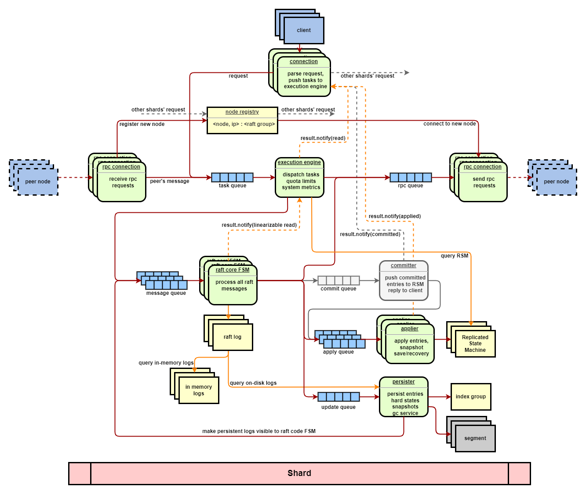

# rafter

## Introduction

rafter (*in progress*) is a pipelined asynchronous multi-raft group library with an in-memory key-value replicated state machine based on seastar.

rafter is deeply inspired by

- [dragonboat](https://github.com/lni/dragonboat)
- [etcd](https://github.com/etcd-io/etcd)
- [braft](https://github.com/baidu/braft)
- [scylla](https://github.com/scylladb/scylla)
- [seastar](https://github.com/scylladb/seastar), insights
  available [here](https://github.com/JasonYuchen/notes/tree/master/seastar)



## Build & Setup

- prerequisite
    - Compiler with C++20 support, tested with clang-12
    - Seastar, *the installation of Seastar is not trivial, please refer to
      this [post](https://github.com/JasonYuchen/notes/blob/master/seastar/Setup.md)*
    - GoogleTest, taken care of by rafter's cmake configuration

```shell
TBD
```

## Module

### Execution

The execution module manages and schedules all raft groups, storage, transport and replicated state machines.

TBD

### Raft Core State Machine

The raft core state machine implements the raft algorithm based on the etcd's design.

TBD

### Storage

The [storage](storage/README.md) module works as the WAL of the raft groups, managing the persistent log entries as well
as the snapshots and the configurations of the clusters.

1. ✔️design doc (lack in-memory log explanation)
2. ✔️segment, a WAL unit
3. ✔️segment test
4. ✔️index, for indexing raft logs (lack dump&load)
5. ⚠️index test (lack group index test)
6. ✔️segment_manager, for managing raft persistent logs
7. ⚠️segment_manager test

### Transport

The [transport](transport/README.md) module based on the seastar's rpc framework works as a messaging service for
clusters.

1. ⚠️design doc
2. ⚠️exchanger, for exchanging raft messages (lack snapshot support)
3. ⚠️exchanger test
4. ⚠️registry, for group discovery and peer addresses management
5. ⭕registry test
6. ⚠️express, for sending replicated state machine's snapshot
7. ⭕express test

### Replicated State Machine

The replicated state machine is a naive in-memory key-value storage to demonstrate the interactions between a user
defined replicated state machine and the underlying framework.

TBD

### Misc

Various utilities to support different modules of the rafter.

1. ✔️backoff, retry in coroutine style
2. ⚠️circuit_breaker
3. ✔️fragmented_temporary_buffer, for aligned (de)serialization
4. ⚠️rate limiter
5. ✔️serializer, for raft message's (de)serialization
6. ✔️worker, double-buffering multi-producer single-consumer worker coroutine, building block for pipelined service in
   rafter

### Test

The [test](test/README.md) module hacks the interface of the [GoogleTest](https://github.com/google/googletest) to
support testing an asynchronous application with GoogleTest's style.

1. ✔️base, for integrating the coroutine and the gtest macros, and the Seastar's reactor engine management
2. ⚠️unit tests
3. ⭕integration tests
4. ⭕benchmark

## Doc

in progress

## License

TBD
