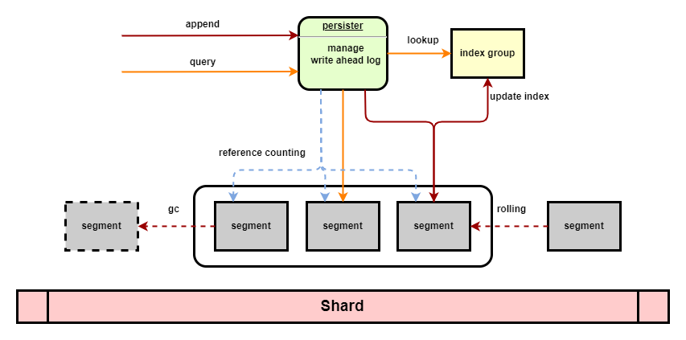

# Rafter Storage

## Overall Design

The storage layer of the Raft protocol should persist the metadata and the log entries. Rafter uses the same design as
the dragonboat that the log entries are kept in both memory and the disk.

TODO: illustrate the in_memory part

TODO: illustrate the snapshot organization

```text
     compacted     not in memory             in memory
 [ .......... 3 ] [ 4  5  6  7 ] [ 8  9  10  11  12  13  14  15  16 ]

 in_memory  [+++]                [++++++++++++++++++++++++++++++++++]
              |                    |      |       |       |       |
           snapshot            marker  applied  commit  saved  latest

 on_disk    [+++] [+++++++++++++++++++++++++++++++++++++++++]
              |     |                                     |
           marker first                                  last
```

## In-memory Layer

TODO: illustrate the in-memory part

## On-disk Layer

### Why not use a KV store such as RocksDB?

The pattern of the Raft log entries is simple: append and persist, and the log entries are marked with consecutive
numbers called log index.

A popular KV store (e.g. RocksDB) is considered too heavy since the pattern is simple and the Rafter respect the
shared-nothing design in Seastar (each Raft cluster is handled within one shard). The rich feature set in KV store such
as concurrency control, transaction, etc., will not be used in Rafter.

We design and implement a naive storage layer for Rafter using write ahead log, WAL. The design mainly refers to
[etcd](https://github.com/etcd-io/etcd), [braft](https://github.com/baidu/braft),
[dragonboat](https://github.com/lni/dragonboat).

### Basic Design

All entries and hard states coming from the Raft module are serialized and appended to a segment file (WAL) with a
corresponding in-memory `index::entry` tracking each entry by its location tuple `(filename, offset)`.

The WAL files are rolling with a threshold size, only the segment with the largest filename is the active segment, all
other WAL files are archived and immutable. The name of a segment has two parts, its prefix is the shard id and its
suffix is a monotonically increasing number starting from `1`.

Log entry index is designed to be flexible and sparse: 1 index slot tracks 1 update (1 or more log entries) within a
single WAL file by recording the following fields:

- start index of consecutive indexes
- end index of consecutive indexes
- name of the WAL file
- offset in this WAL file
- total bytes occupied by these entries

Log entry index is kept in memory and only rebuilt during crash recovery by replaying all existing segments.

```text
                     -------------- segment manager --------------
                    /                      |                      \             
                   /                       |                       \
              segment ptr              segment ptr              segment ptr
             +-----------+                 |                        | 
             |meta/index |                 |                        |
             +-----------+                 |                        |
memory            |                        |                        |
------------------|------------------------|------------------------|-------------
disk(s)           |                        |                        |
               00001.log                00056.log                00129.log
             +-----------+            +-----------+            +-----------+
             |           |            |           |            |           |
             +-----------+            +-----------+            +-----------+

rafter @ disk0                                     <- root dir of a shard
  ├── config
  |    ├── {cluster_id:020d}_{node_id:020d}.yaml   <- raft config
  |    └── ...
  ├── bootstrap
  │    ├── {cluster_id:020d}_{node_id:020d}        <- bootstrap info of a cluster
  │    ├── {cluster_id:020d}_{node_id:020d}.tmp    <- tmp bootstrap info of a cluster
  │    └── ...
  ├── wal
  │    ├── {shard:05d}_{seq:020d}.log              <- raft log of clusters sitting on the same shard
  │    ├── {shard:05d}_{seq:020d}.log
  │    └── ...
  └── snapshot
       ├── {cluster_id:020d}_{node_id:020d}        <- root dir of temp snapshot files of a cluster
       │    ├── {index:016X}-{from}.generating     <- temp dir for generating snapshot files
       │    │    ├── snapshot.metadata
       │    │    ├── snapshot.flag
       │    │    ├── {index:016X}.snap
       │    │    ├── {file_id}.sm                  <- state machine provided files (hard link)
       │    │    └── ...
       │    └── {index:016X}-{from}.receiving      <- temp dir for receiving snapshot files
       │         └── ...
       ├── {cluster_id:020d}_{node_id:020d}
       │    └── {index:016X}                       <- root dir of finalized snapshot files of a cluster
       │         └── ...                              renamed from a temp dir with generating/receiving suffix
       └── ...

rafter @ disk1                                     <- different shards can be stored in different dirs/disks 
  ├── config
  ├── bootstrap
  ├── wal
  └── snapshot
```



### Further Considerations

Currently, we implement the **one WAL per shard**. The snapshot files are always isolated since snapshotting is far less
frequent.

1. **one WAL per Raft node**, `N Raft nodes -> N WALs`
    - the design and implementation are easier and more straight forward (**pro**)
    - indexes of same Raft node can be merged to reduce memory usage (**pro**)
    - isolation among Raft nodes, no need to coordinate compaction, good for clusters with different workloads (**pro**)
    - if too many Raft groups are bootstrapped, the number of segments could be huge (**con**)
    - as the segments number increases, the number of `async` call increases (**con**)
2. **one WAL per shard**, `N Raft nodes -> S WALs -> S shards`
    - the total number of segments is small, equal to the number of shards (**pro**)
    - maintain fewer files and issue fewer syscalls (**pro**)
    - have to coordinate Raft nodes since the WAL is shared among all Raft nodes within one shard (**con**)
    - the log entries of a Raft node is not consecutive, but so long as we are not frequently accessing the on-disk
      entries, it should not be an issue (**con**)
    - if we restart the system with different number of shards, we need to re-shard the existing segments (**con**)
    - not good for clusters with different workloads, e.g. a "cold" node may hold references to many segments and block
      segments' garbage collection procedure, may need an advanced GC design like LSM's compaction (**con**)

   Some notes from `commitlog` design in ScyllaDB (the flow of replay `commitlog`):
    1. list and re-shard all existing segments
    2. replay logs in each new shard
    3. apply the mutations in target shard using `invoke_on` (i.e. the log replayed in new shard 1 may contain mutations
       belong to a foreign db in shard 3)
    4. flush all mem tables to disk to make the mutations durable
    5. delete existing segments see `/main.cc: replaying commit log`
       and `/db/commitlog/commitlog_replayer.cc: db::commitlog_replayer::recover` for more details

   If Rafter uses this way, then we should (changing shards is not allowed for now):
    1. list and re-shard all existing segments
    2. replay logs in each new shard
    3. send the Raft entry to target shard to reconstruct segment using `invoke_on`
    4. trigger snapshot and compaction to retire existing segments
    5. delete existing segments
3. **sharding WALs for one shard**, `N Raft nodes -> M WALs -> S shards`
    - the total number of segments is small (**pro**)
    - have to coordinate (**con**)
    - still have to re-shard if M WALs changed (**con**)
    - no need to re-shard if Seastar's shard changed (**pro**)
    - maybe too complicated to implement and manage (**con**)

### Normal Flow

*CAUTION: though all operations are handled in one thread/shard, there can still be data race among coroutines*

Currently, we only allow one coroutine working as a Raft step engine to access the underlying storage engine because the
WAL file are shared among all Raft nodes in this shard (need synchronization if we allow more coroutines).

- **write**
    1. append log entries, never overwrite
    2. update index
    3. rolling if exceeds size threshold
    4. fdatasync
- **read**
    1. query the log entry index to find out the locations of the entries
    2. the index should block all requests with index < snapshot index even the segment may still exist due to lazy
       garbage collection
    3. use locations to fetch the corresponding entries
    4. trigger a compaction routine if the start index of this read <= gc start point, like read-triggered compaction
- **rolling**
    1. create new segment
    2. fdatasync
- **compaction**
    1. append a compaction entry and the index will be updated accordingly
    2. get obsolete segments from one node index and decrease the reference count of these segments
    3. once a segment is no longer needed, push it to the gc queue for removal

### Recovery Flow

1. block all requests as the storage layer is being recovered
2. parse all segments to rebuild logs and indexes
3. compact obsolete segments (Not implemented yet)
4. ready for service

```text
             segment
    +-----------------------+
    | bytes update          |  <-- serialized update structure
    +-----------------------+
    | bytes update          |
    +-----------------------+
    |        ......         |
    +-----------------------+
    
only have to persist these fields in update:
    - gid (cluster id & node id)
    - state (term, vote & commit)
    - entries_to_save
    - snapshot
```

### Possible Limitations

1. The indexes are kept in memory only, which may consume too much memory, in the future we can **dump the indexes into
   files** and load these index files in need.
2. The segment files are created in need, in the future we can use **pre-allocation** to reduce the average cost.
3. Raft clusters with different workloads may degrade the segments' garbage collection, a "code" node may prevent
   segments from being collected, which may waste the disk space and slowdown the recovery. May need a Raft cluster
   distribution policy to **allow users to separate hot and cold clusters**.
4. The rolling is performed after writing to the segment, which means the segment is always larger than the rolling
   threshold. It should be better to check before writing to ensure all segments are not larger than the threshold

## Snapshot Organization

TODO: design snapshot organization
