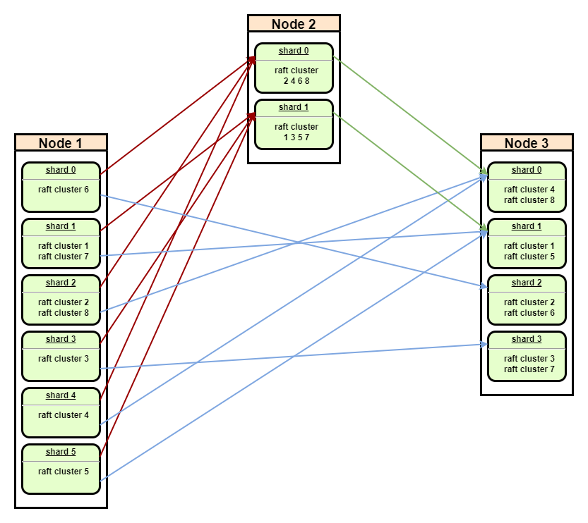

# Rafter Transport

## Overall Design

The transport layer of the Raft protocol should deliver RPC requests and snapshots. Rafter employs the Seastar's RPC
framework and refers to the design of the ScyllaDB's messaging service.

## Shard-to-Node Connection

To fully utilize the hardware resources and honor the Seastar's shared-nothing architecture, transport layer is also
sharded and maintains a shard-to-node connection map.

- Each shard will connect to a remote node (the shard with overlapping raft clusters) independently
    - the target shard is specified with the help of [Seastar's *port*
      policy](https://github.com/scylladb/seastar/blob/master/doc/network-connection-load-balancing.md#load-balancing)
    - all shards use a special *meta* gateway to exchange the knowledge of hosting nodes (e.g. shard count, raft cluster
      info, etc.)
- For a cross-shard message, e.g. the connection delivers a `cluster#2`'s message from `node#1.shard#2`
  to `node#3.shard#0`, shared-nothing is honored and `smp::submit_to` is invoked to forward this message
  to `node#3.shard#2`
- Once a message from a new node is found, the knowledge will propagate to all shards to notify the join/rejoin of the
  node
- Once a broken pipe is found in one shard, the exception will propagate to all shards to notify the lost of the node

*The implementation is still evolving to achieve the above goals.*

## Snapshot Streaming

TODO: introduce the snapshot express and the management of ongoing/out-dated snapshots.

## Node Discovery & Registry

TODO: introduce the registry.
